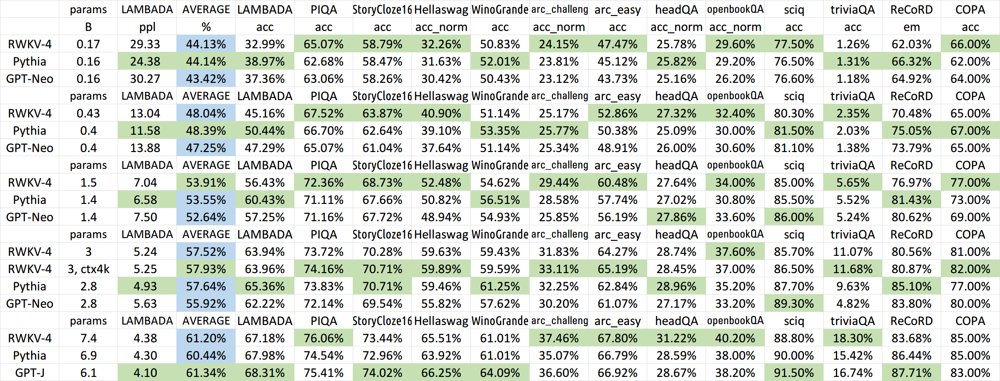

# The RWKV Language Model 

## 介绍
RWKV: Parallelizable RNN with Transformer-level LLM Performance (pronounced as "RwaKuv", from 4 major params: R W K V)

RWKV is an RNN with Transformer-level LLM performance, which can also be directly trained like a GPT transformer (parallelizable). And it's 100% attention-free. You only need the hidden state at position t to compute the state at position t+1. You can use the "GPT" mode to quickly compute the hidden state for the "RNN" mode.

So it's combining the best of RNN and transformer - **great performance, fast inference, saves VRAM, fast training, "infinite" ctx_len, and free sentence embedding** (using the final hidden state).

### 界面和下载
* **Raven 14B** (finetuned on Alpaca+ShareGPT+...) Demo: https://huggingface.co/spaces/BlinkDL/ChatRWKV-gradio
* **Raven 7B** (finetuned on Alpaca+ShareGPT+...) Demo: https://huggingface.co/spaces/BlinkDL/Raven-RWKV-7B
* **ChatRWKV:** with "stream" and "split" strategies and INT8. **3G VRAM is enough to run RWKV 14B :)** https://github.com/BlinkDL/ChatRWKV
* **Download RWKV-4 0.1/0.4/1.5/3/7/14B weights**: https://huggingface.co/BlinkDL
* **RWKV pip package**: https://pypi.org/project/rwkv/

```python
os.environ["RWKV_JIT_ON"] = '1'
os.environ["RWKV_CUDA_ON"] = '0' # if '1' then use CUDA kernel for seq mode (much faster)
from rwkv.model import RWKV                         # pip install rwkv
model = RWKV(model='/fsx/BlinkDL/HF-MODEL/rwkv-4-pile-1b5/RWKV-4-Pile-1B5-20220903-8040', strategy='cuda fp16')

out, state = model.forward([187, 510, 1563, 310, 247], None)   # use 20B_tokenizer.json
print(out.detach().cpu().numpy())                   # get logits
out, state = model.forward([187, 510], None)
out, state = model.forward([1563], state)           # RNN has state (use deepcopy if you want to clone it)
out, state = model.forward([310, 247], state)
print(out.detach().cpu().numpy())                   # same result as above
```

### 文章和项目
**RWKV Projects**:
* https://github.com/saharNooby/rwkv.cpp fast i4 i8 fp16 fp32 CPU inference using [ggml](https://github.com/ggerganov/ggml)
* https://github.com/harrisonvanderbyl/rwkv-cpp-cuda fast windows/linux & cuda/rocm/vulkan GPU inference (no need for python & pytorch)
* https://github.com/Blealtan/RWKV-LM-LoRA LoRA fine-tuning
* https://github.com/josStorer/RWKV-Runner cool GUI
* More RWKV projects: https://github.com/search?o=desc&q=rwkv&s=updated&type=Repositories
* **RWKV in 150 lines** (model, inference, text generation): https://github.com/BlinkDL/ChatRWKV/blob/main/RWKV_in_150_lines.py
* **RWKV文章** https://arxiv.org/abs/2305.13048


**RWKV介绍 (numpy)**: https://johanwind.github.io/2023/03/23/rwkv_overview.html https://johanwind.github.io/2023/03/23/rwkv_details.html
* 使用RWKV的文章: https://github.com/ridgerchu/SpikeGPT
* 知乎介绍1 https://zhuanlan.zhihu.com/p/514840332
* 知乎介绍2 https://zhuanlan.zhihu.com/p/616351661


RWKV [loss vs token position] for 10000 ctx4k+ documents in Pile. RWKV 1B5-4k is mostly flat after ctx1500, but 3B-4k and 7B-4k and 14B-4k have some slopes, and they are getting better. This debunks the old view that RNNs cannot model long ctxlens. We can predict that RWKV 100B will be great, and RWKV 1T is probably all you need :)


ChatRWKV with RWKV 14B ctx8192:


RNN is a better candidate for fundamental models, because: 
- It's more friendly for ASICs (no kv cache). 
- It's more friendly for RL. (3) When we write, our brain is more similar to RNN. (4) The universe is like an RNN too (because of locality). Transformers are non-local models.

RWKV-3 1.5B on A40 (tf32) = always 0.015 sec/token, tested using simple pytorch code (no CUDA), GPU utilization 45%, VRAM 7823M

GPT2-XL 1.3B on A40 (tf32) = 0.032 sec/token (for ctxlen 1000), tested using HF, GPU utilization 45% too (interesting), VRAM 9655M

Training speed: (new training code) RWKV-4 14B BF16 ctxlen4096 = 114K tokens/s on 8x8 A100 80G (ZERO2+CP). (old training code) RWKV-4 1.5B BF16 ctxlen1024 = 106K tokens/s on 8xA100 40G.

## image experiments 
For example: https://huggingface.co/BlinkDL/clip-guided-binary-autoencoder) and RWKV will be able to do txt2img diffusion

Smooth training - no loss spikes! (lr & bsz change around 15G tokens)




All of the trained models will be open-source. Inference is very fast (only matrix-vector multiplications, no matrix-matrix multiplications) even on CPUs.

How it works: RWKV gathers information to a number of channels, which are also decaying with different speeds as you move to the next token. It's very simple once you understand it.

**RWKV is parallelizable because the time-decay of each channel is data-independent (and trainable)**. For example, in usual RNN you can adjust the time-decay of a channel from say 0.8 to 0.5 (these are called "gates"), while in RWKV you simply move the information from a W-0.8-channel to a W-0.5-channel to achieve the same effect. Moreover, you can fine-tune RWKV into a non-parallelizable RNN (then you can use outputs of later layers of the previous token) if you want extra performance.


* HuggingFace integration (check https://github.com/huggingface/transformers/issues/17230
)

* Test it on bidirectional & MLM tasks, and image & audio & video tokens.

* Now training RWKV-4a with one single tiny extra attention (just a few extra lines comparing with RWKV-4) to further improve some difficult zeroshot tasks (such as LAMBADA) for smaller models. See https://github.com/BlinkDL/RWKV-LM/commit/a268cd2e40351ee31c30c5f8a5d1266d35b41829


## Quick start

**IMPORTANT: Use deepspeed==0.7.0 pytorch-lightning==1.9.2 torch 1.13.1+cu117**

Use https://github.com/BlinkDL/RWKV-LM/tree/main/RWKV-v4neo (latest code, compatible with v4).

Here is a great prompt for testing Q&A of LLMs. Works for any model: (found by minimizing ChatGPT ppls for RWKV 1.5B)
```python
prompt = f'\nQ & A\n\nQuestion:\n{qq}\n\nDetailed Expert Answer:\n' # let the model generate after this
```

### Inference

**Run RWKV-4 Pile models:** Download models from https://huggingface.co/BlinkDL. Set TOKEN_MODE = 'pile' in run.py and run it. It's fast even on CPU (the default mode).

**Colab for RWKV-4 Pile 1.5B**: https://colab.research.google.com/drive/1F7tZoPZaWJf1fsCmZ5tjw6sYHiFOYVWM

Run RWKV-4 Pile models in your browser (and onnx version): see this issue https://github.com/BlinkDL/RWKV-LM/issues/7

RWKV-4 Web Demo: https://josephrocca.github.io/rwkv-v4-web/demo/ (note: only greedy sampling for now)

For the old RWKV-2: see the release here for a 27M params model on enwik8 with 0.72 BPC(dev). Run run.py in https://github.com/BlinkDL/RWKV-LM/tree/main/RWKV-v2-RNN. You can even run it in your browser: https://github.com/BlinkDL/AI-Writer/tree/main/docs/eng https://blinkdl.github.io/AI-Writer/eng/ (this is using tf.js WASM single-thread mode).

### Training / Fine-tuning

pip install deepspeed==0.7.0 // pip install pytorch-lightning==1.9.2 // torch 1.13.1+cu117

**Training RWKV-4 from scratch:** run train.py, which by default is using the enwik8 dataset (unzip https://data.deepai.org/enwik8.zip).

You will be training the "GPT" version because it's paralleziable and faster to train. RWKV-4 can extrapolate, so training with ctxLen 1024 can work for ctxLen of 2500+. You can fine-tune the model with longer ctxLen and it can quickly adapt to longer ctxLens.

**Fine-tuning RWKV-4 Pile models:** use 'prepare-data.py' in https://github.com/BlinkDL/RWKV-v2-RNN-Pile/tree/main/RWKV-v3 to tokenize .txt into train.npy data. Then use https://github.com/BlinkDL/RWKV-LM/blob/main/RWKV-v4neo/train.py to train it.

Read the inference code in src/model.py and try using the final hidden state（.xx .aa .bb) as a faithful sentence embedding for other tasks. Probably you should begin with .xx and .aa/.bb (.aa divided by .bb).

Colab for fine-tuning RWKV-4 Pile models: https://colab.research.google.com/github/resloved/RWKV-notebooks/blob/master/RWKV_v4_RNN_Pile_Fine_Tuning.ipynb

**Large corpus:** Use https://github.com/EleutherAI/gpt-neox to convert .jsonl into .bin and .idx
```
python tools/preprocess_data.py --input ./my_data.jsonl --output-prefix ./data/my_data --vocab ./20B_tokenizer.json --dataset-impl mmap --tokenizer-type HFTokenizer --append-eod
```

**UPDATE:** now you can use https://github.com/Abel2076/json2binidx_tool (much easier to install)

The jsonl format sample (one line for each document):
```
{"text": "This is the first document."}
{"text": "Hello\nWorld"}
{"text": "1+1=2\n1+2=3\n2+2=4"}
```
generated by code like this:
```
ss = json.dumps({"text": text}, ensure_ascii=False)
out.write(ss + "\n")
```

### How to use RWKV hidden state as text embedding

Consider RWKV 14B. The state has 200 vectors, that is, 5 vectors for each block: fp16 (xx), fp32 (aa), fp32 (bb), fp32 (pp), fp16 (xx).

Do not avg pool because different vectors (xx aa bb pp xx) in the state have very different meanings and ranges. You can probably remove pp.

I suggest firstly collect the mean+stdev statistics of each channel of each vector, and normalize all of them (note: the normalization should be data-indepedent and collected from various texts). Then train a linear classifer.

